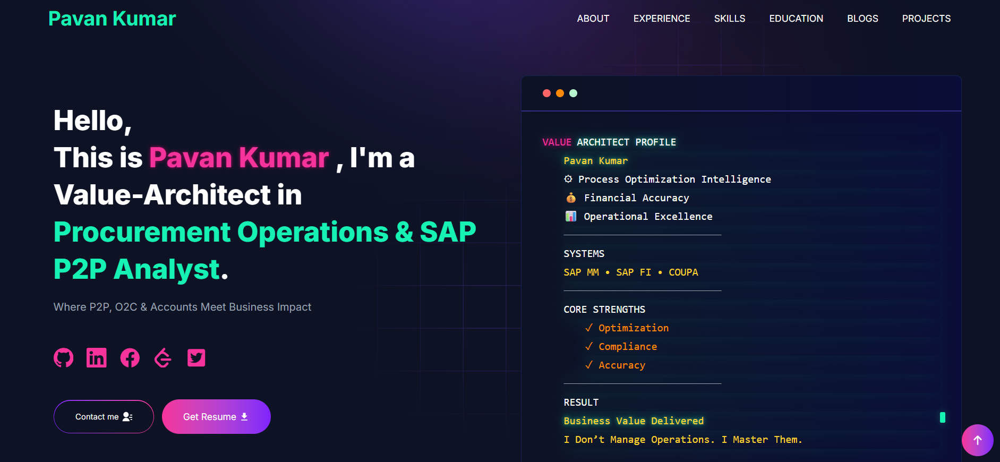

<h1 align="center">Pavan Kumar — Personal Portfolio</h1>

<p align="center">
  <strong>Procurement Operations Associate • Technology Enthusiast • Continuous Learner</strong>
</p>

<p align="center">
  A modern personal portfolio showcasing professional experience, skills, projects, and technology interests.
</p>

<p align="center">
  
  
  
  
  
</p>

<p align="center">
  <a href="#live-demo">Live Demo</a> •
  <a href="#overview">Overview</a> •
  <a href="#features">Features</a> •
  <a href="#tech-stack">Tech Stack</a> •
  <a href="#installation">Installation</a> •
  <a href="#customization">Customization</a> •
  <a href="#deployment">Deployment</a> •
  <a href="#author">Author</a>
</p>

---

# Live Demo

🌐 **Portfolio Website**

https://pavankumar-alpha.vercel.app

---

# Overview

This repository contains the source code for **Pavan Kumar’s Personal Portfolio Website**.

The portfolio is designed to present:

• Professional background
• Technical interests
• Projects and learning journey
• Skills and experience

Built with modern technologies like **Next.js**, **React**, and **Tailwind CSS**, the website focuses on performance, responsiveness, and clean user experience.

The architecture is **data-driven**, allowing easy customization through simple configuration files.

---

# Screenshots

<p align="center">
  
</p>

---

# Features

✨ Modern responsive portfolio layout
⚡ Built using Next.js App Router architecture
🎨 Clean UI with Tailwind CSS styling
🚀 Fast performance and optimized rendering
📱 Fully responsive design for all devices
🧩 Modular component structure
📧 Contact form with email notifications
🤖 Optional Telegram notification support
📝 Blog integration via dev.to
🐳 Optional Docker support
📊 Optional analytics integration

---

# Tech Stack

| Technology   | Purpose              |
| ------------ | -------------------- |
| Next.js      | React Framework      |
| React        | UI library           |
| Tailwind CSS | Styling              |
| JavaScript   | Core scripting       |
| SASS         | CSS preprocessor     |
| Axios        | API communication    |
| Nodemailer   | Email functionality  |
| Lottie       | Animation support    |
| Docker       | Container deployment |

---

# Portfolio Sections

| Section    | Description                       |
| ---------- | --------------------------------- |
| Hero       | Personal introduction             |
| About      | Professional summary              |
| Experience | Work experience                   |
| Skills     | Technical and professional skills |
| Projects   | Portfolio projects                |
| Education  | Academic details                  |
| Blog       | Articles from dev.to              |
| Contact    | Contact form                      |

---

# Installation

## Prerequisites

Ensure the following tools are installed:

| Tool       | Version |
| ---------- | ------- |
| Node.js    | v18+    |
| Git        | Latest  |
| pnpm / npm | Latest  |

Check installation:

```bash
node --version
git --version
npm --version
```

---

# Getting Started

Clone the repository

```bash
git clone https://github.com/pavankumarofficialmail-commits/pavankumar.git
```

Move into the project directory

```bash
cd pavankumar
```

Install dependencies

```bash
npm install
```

Start development server

```bash
npm run dev
```

Open

```
http://localhost:3000
```

---

# Environment Variables

Create a `.env` file

```env
NEXT_PUBLIC_APP_URL=https://pavankumar-alpha.vercel.app

NEXT_PUBLIC_GTM=GTM-XXXXXXX

TELEGRAM_BOT_TOKEN=your_bot_token
TELEGRAM_CHAT_ID=your_chat_id

EMAIL_ADDRESS=your_email@gmail.com
GMAIL_PASSKEY=your_app_password
```

---

# Customization

All content is managed through data files located in:

```
utils/data/
```

Key files include:

| File             | Purpose               |
| ---------------- | --------------------- |
| personal-data.js | Personal details      |
| experience.js    | Work experience       |
| projects-data.js | Projects list         |
| skills.js        | Skills information    |
| educations.js    | Education details     |
| contactsData.js  | Contact configuration |

Example configuration:

```javascript
export const personalData = {
  name: "Pavan Kumar",
  designation: "Procurement Operations Associate | Technology Enthusiast",
  location: "India",
  github: "https://github.com/pavankumarofficialmail-commits",
};
```

---

# Deployment

This project is deployed using **Vercel**.

Steps to deploy:

1. Push the repository to GitHub
2. Import the repository in Vercel
3. Configure environment variables
4. Deploy

Future updates will automatically deploy when pushing to the repository.

---

# Folder Structure

```
app/
components/
public/
utils/
utils/data/
.env.example
package.json
README.md
```

---

# Author

**Pavan Kumar**

Procurement Operations Associate
Technology Enthusiast

Location
India

GitHub
https://github.com/pavankumarofficialmail-commits

Portfolio
https://pavankumar-alpha.vercel.app

---

# License

This project is licensed under the **MIT License**.
